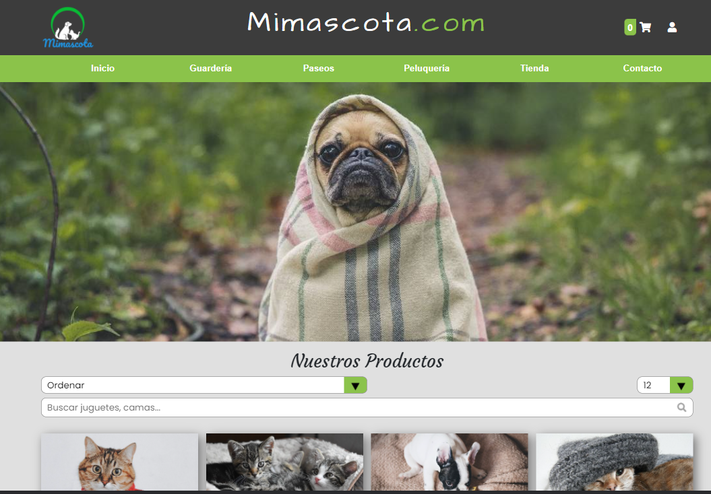
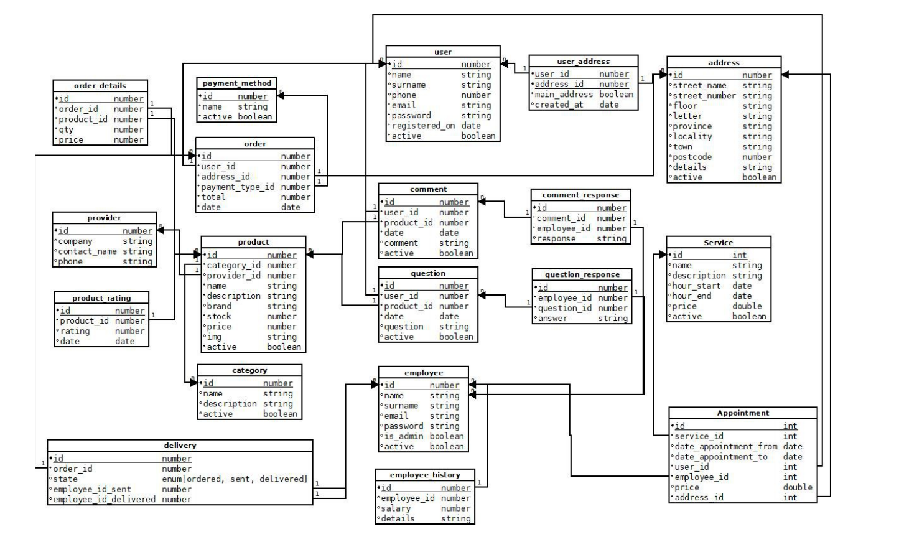

# Animalia



---

### Description
Online full shop and appointment system application made as TFC to finish my studies as a web developer.
Full stack Type Script application, node in back and angular in front. SQL for db and some bootstrap used.
The application has a functional full shoping process, see products, filter, search and pagination. Handle user register, login, profile editing, address manager capable of having more than one address. Service appointment system managing dates and capability.
And an admin side to control deliveries, appointments and needed CRUDS.


---

## Use

1. Database: in the BACK/database is the sql file to build the DB and some data. Create the db and update the information in BACK/server/src/keys.ts

2. Backend:
    * ```npm install``` in BACK/server folder to install the needed packages.
    * ```npm run build``` in BACK/server folder to create the build folder with the JS files.
    * ```npm run dev``` in BACK/server folder to run the back in localhost.

3. Frontend:
    * ```npm install``` in FRON folder to install the needed packages.
    * ```ng serve -o``` to run and open the application in a browser.
---

## Technologies

- Angular
- Type Script
- SQL
- NODE, EXPRESS
- Bootstrap


---

## Usage

A full documentation and usage guide is added in .odt and .pdf in the root folder named "Proyecto Federico Andrés Jácome Castañeda"

---

## Database structure


---

## Author Info

- Linkedin - [Federico Andrés Jácome Castañeda](https://www.linkedin.com/in/federicojacome/)
- Website - [To be added](https://github.com/federocky)

[Back To The Top](#read-me-template)
